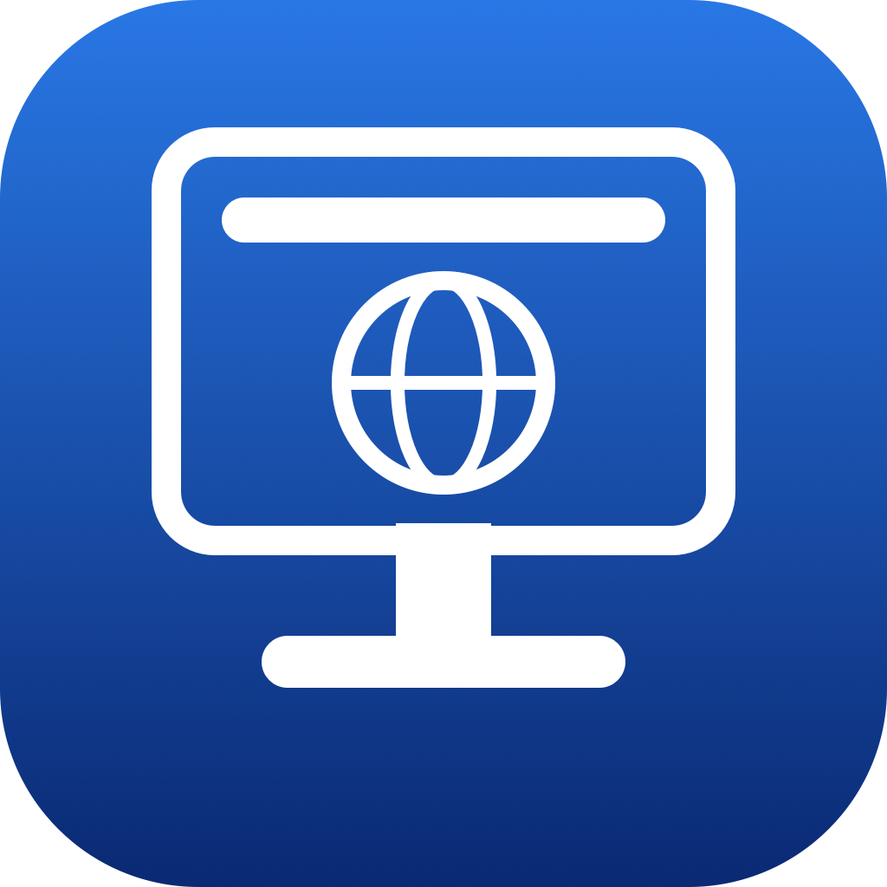

<p align="center">
  
</p>

# FocusKiosk

A minimal iOS/iPadOS kiosk browser: it displays a single website in full screen and keeps visitors from navigating away from it. Built with SwiftUI and WKWebView - no dependencies.

Typical uses: time clocks, dashboards, check-in stands, digital signage, front-desk displays.

## Features

- **Full-screen web view** - status bar and system overlays hidden, screen never sleeps.
- **Locked to one site** - main-frame navigation outside the configured domain (and its subdomains) is blocked, so logins and in-site links keep working but visitors can't wander off.
- **Idle auto-refresh** - after a configurable period with no touches (10 s – 1 h, default 2 min), the page reloads back to the configured URL.
- **Hidden configuration screen** - press and hold with **two fingers for 2 seconds**, then enter the PIN.
- **PIN protection** - default PIN is `0987`; change it in Configuration (4+ digits).
- **QR code setup** - scan a QR code instead of typing a long URL by hand.
- **Self-healing** - load failures show a retry screen instead of a blank page, and the web view recovers automatically if iOS kills its content process.
- **Camera passthrough** - camera permission requests from the configured site are granted automatically, so unattended kiosks never show a permission dialog a visitor could dismiss. Microphone requests are always denied.
- **MDM/JAMF managed config** - the homepage URL can be pushed remotely via AppConfig (`HomepageURL` key), overriding the local setting and locking it in the UI.

## Getting started

1. Open `FocusKiosk.xcodeproj` in Xcode and run it on an iPhone or iPad (iOS 16.6+).
2. On first launch, a welcome screen explains the basics and offers to open Configuration.
3. Set your URL (bare hostnames get `https://` automatically), pick an idle-refresh interval, and change the PIN.
4. Later, reopen Configuration anytime with the two-finger long press + PIN.

Settings persist across launches via `UserDefaults`.

For a true kiosk deployment, pair the app with iOS **Guided Access** (Settings → Accessibility) or an MDM **Single App Mode** policy so the device stays locked into the app itself.

## Project layout

| File | Purpose |
| --- | --- |
| `FocusKioskApp.swift` | App entry point. |
| `ContentView.swift` | Root view; owns persisted settings and presents the welcome / PIN / config sheets. |
| `KioskController.swift` | Owns the `WKWebView`, enforces the domain lock, drives the idle-refresh timer, auto-grants camera access. |
| `KioskWebView.swift` | SwiftUI bridge for the web view plus the touch recognizers (idle-timer reset, two-finger reveal gesture). |
| `ConfigView.swift` | Settings form: URL, refresh interval, PIN change, QR scan entry point. |
| `PinEntryView.swift` | PIN prompt guarding the settings screen. |
| `QRScannerView.swift` | AVFoundation-based QR scanner for entering URLs. |
| `WelcomeView.swift` | One-time first-launch walkthrough. |
| `ManagedConfigManager.swift` | Reads MDM-managed AppConfig from `UserDefaults` and publishes the managed `HomepageURL` if set. |

## Requirements

- iOS / iPadOS 16.6 or later
- Xcode 26 or later to build

## JAMF / MDM deployment

The app supports [AppConfig](https://www.appconfig.org) for remote configuration. Set the following key in your MDM's app configuration payload:

| Key | Type | Description |
| --- | --- | --- |
| `HomepageURL` | String | URL the kiosk displays. Overrides the local setting and locks it in the UI. |

Example JAMF App Configuration XML:

```xml
<dict>
    <key>HomepageURL</key>
    <string>https://your-company.com/kiosk</string>
</dict>
```

When a managed URL is active, the URL field in the Configuration screen is shown as read-only. Removing the key from MDM reverts to the locally stored URL.

## Notes

- The web view identifies itself as Mobile Safari so sites don't show "outdated browser" warnings for the bare WKWebView user agent.
- The kiosk PIN is a convenience lock stored in `UserDefaults`, not a security boundary - anyone with physical access to an unsupervised device could bypass it. Use Guided Access or MDM for real lockdown.

## License

FocusKiosk is released under the [MIT License](LICENSE).
